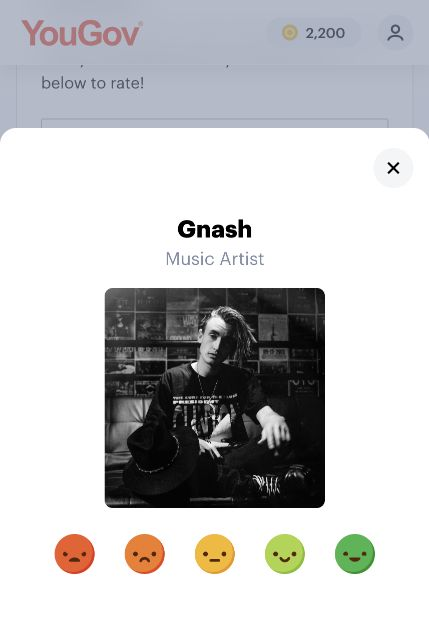

I participated in YouGov activities that included questions about pop culture, politics, radio shows, and influencers. The questions generally seemed clear, but some were difficult to answer because I did not know who or what they referred to. This experience showed me that clear wording alone does not guarantee that a respondent has enough knowledge to give a meaningful answer.

I did not take screenshots during my original survey. The two examples below were captured afterward from the current YouGov Ratings page. They illustrate the same issue I experienced: being asked to evaluate an unfamiliar subject. I am unfamiliar with both Gnash and Rigoletto.

## Rating Gnash

{width=240px}

The first example asks for a rating of Gnash, identified as a music artist. The visible response choices are five faces ranging from negative to positive. I chose this example because I do not know this artist well enough to evaluate him. A middle face could mean a neutral opinion, but unfamiliarity is a different situation. The displayed dialog does not show a separate “not familiar” choice, although it can be closed without choosing a rating.

For my own questionnaire, I would separate awareness from opinion. I would first ask whether the respondent has heard of the subject, then ask for an evaluation only when the respondent has enough knowledge. I would also label each scale point with words so respondents can interpret the choices consistently.

## Rating Rigoletto

{width=240px}

The second example presents Rigoletto, labeled “Musical” on the page, with the same five face-based choices. I chose it because I am unfamiliar with the production. Seeing its name and an image does not give me enough information to judge it. A favorable or unfavorable rating from me would therefore risk reflecting a guess rather than an informed opinion.

This example shows why familiarity and direct experience should be measured separately. Someone might recognize a production without having attended it. Similarly, someone might have heard of a restaurant without having eaten there. Questions should make clear whether they ask about reputation, expectations, or personal experience.

## Applying the lessons to my CEP project

My CEP research project focuses on The Restaurant at Kellogg Ranch. I would begin by asking whether respondents have heard of the restaurant and whether they have dined there. Respondents who have visited could evaluate food, service, atmosphere, and value. Those who have not visited could answer questions about awareness, expectations, and what might encourage them to visit.

## Designing questions respondents can answer

I would ask about one topic at a time and specify a relevant visit or time period. For example, “How satisfied were you with the service during your most recent visit?” is easier to interpret than a question combining food and service. I would include “not applicable” or “cannot evaluate” when a respondent lacks the relevant experience. A neutral opinion should remain separate from not knowing.

## Testing the questionnaire

Before distributing my questionnaire, I would ask a few people to complete it and explain any choices they found difficult. I would include both people who have visited the restaurant and people who have not. This would help me check the wording, answer choices, and routing. My main lesson is to respect the limits of respondents’ knowledge so the results reflect their actual experiences rather than guesses.

## Published files

[GitHub repository](https://github.com/gmonjarrez/consumer-panel-experience)

[HTML report](https://gmonjarrez.github.io/consumer-panel-experience/)

[QMD source](https://github.com/gmonjarrez/consumer-panel-experience/blob/main/Consumer_Panel_Report.qmd)
